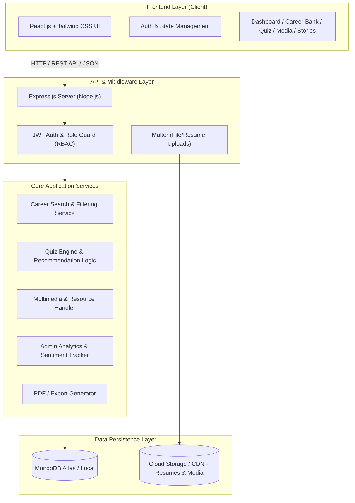

# 🎓 PathSeeker — Career Passport Platform
> **Empowering Students, Graduates, and Working Professionals to Discover What Fits Them Best.**

[](https://www.aptech-worldwide.com)
[](https://github.com)
[](https://github.com)
[](https://react.dev)

---

## 📌 1. Project Overview & Background

### 1.1 The Problem
In today's fast-evolving job market, **students, graduates, and professionals** struggle to navigate career options that align with their distinct skills, passions, and educational backgrounds. Most existing platforms provide generic information, lack structured progression paths, and do not offer personalized role-specific guidance.

### 1.2 The Solution: PathSeeker
**PathSeeker** is a responsive, interactive, and personalized **Career Passport Web Application**. Built for the **TechWiz 6 Global AI-based Tech Competition**, PathSeeker bridges the gap in accessible career mentorship through:
- **Role-Based Segmentation:** Tailored experiences for Students, Graduates, and Working Professionals.
- **Smart Career Bank:** Search and multi-level filtering by domain, salary, skills, and industry demand.
- **AI-Powered / Interactive Interest Quiz:** Timed questions, Likert scales, and dynamic career path suggestions.
- **Interactive Multimedia Center:** Video explainers, audio podcasts, transcripts, and community feedback.
- **Success Stories Hub:** Visual timeline storytelling (Education → Challenges → Outcome).
- **Document Resource Library:** Downloadable guides, PDF auto-previews, and popularity tracking.
- **Bookmarking & Notes Engine:** Save careers, attach notes, and export summaries to PDF.
- **Admin Control Panel & Analytics:** Complete content management, moderation, and usage telemetry.
- **Interactive Home Page Sitemap:** Comprehensive visual site index for seamless navigation.

---

## 🏗️ 2. System Architecture



---

## 🌟 3. Key Functional Modules (SRS Alignment)

### 3.1 🔐 User Authentication & Role Management
- **Role-Based Registration & Login:** Dedicated onboarding flows for **Student**, **Graduate**, **Working Professional**, and direct access for **Admin**.
- **Secure Sessions:** JWT-based stateless authentication with encrypted HTTP-only cookies / bearer tokens.
- **Password Recovery:** Forgot Password / Reset Password via secure OTP / Tokenized Email verification.
- **Dynamic Profile Management:** Manage education history, technical/soft skills, interests, work experience, and optional **Resume File Upload** (.pdf, .docx).

### 3.2 📊 Personalized User Dashboard
- **Role-Specific Greetings:** Dynamic greetings and progress indicators customized to the user's career stage.
- **Activity & Progress Feed:** Recent quiz results, recently viewed careers, active bookmarks, and quick notes.
- **Recommendation Engine:** Dynamic widgets such as *"Top Picks for You"*, *"Trending Careers"*, and *"If you liked this..."*.

### 3.3 💼 Dynamic Career Bank (Advanced Filtering & Search)
- **Extensive Job Database:** Detailed profiles including descriptions, required skills, learning roadmaps, salary ranges, and job demand.
- **Multi-Level Filters:** Filter by industry domain (Tech, Healthcare, Business, Creative), skill match, salary range, and job growth.
- **Smart Search:** Live autocomplete, instant search, and fuzzy keyword tolerance.
- **Saved Filters:** Save custom filter combinations for instant 1-click access.

### 3.4 🧠 Interactive & AI-Powered Interest Quiz
- **Dynamic Question Types:** Multi-step wizard with timed questions, interactive sliders, and 1–5 Likert scale ratings.
- **Progress Tracking:** Automatic quiz history logging with score comparisons over time.
- **Career Stream Matching:** Intelligent scoring algorithm mapping quiz scores to optimal streams and trending job roles.

### 3.5 🎥 Multimedia Learning Center
- **Rich Media Support:** Embedded video masterclasses, audio podcasts, and animated career explainers.
- **Custom Player Features:** Interactive transcript toggle, variable playback speed (0.5x – 2x), and related content cards.
- **Feedback & Community Ratings:** 5-star ratings, thumbs-up/down, and user reviews.

### 3.6 🏆 Success Stories Hub
- **Card-Based Story Feed:** Filter inspirational career transitions by domain.
- **Timeline-Style Storytelling:** Structured visual timeline displaying **Educational Path ➔ Major Challenges ➔ Milestones ➔ Career Breakthrough**.
- **User Submissions:** Community users can submit their personal stories, subject to Admin approval.

### 3.7 📚 Document Resource Library
- **Categorized Downloads:** Career cheat-sheets, salary guides, interview checklists, and scholarship PDFs.
- **Auto-Preview Modals:** In-browser document viewer popups before downloading.
- **Analytics:** Download count tracking and popularity badges (*"Most Popular"*, *"Trending"*).

### 3.8 📝 Bookmarking, Personal Notes & Export
- **1-Click Bookmarking:** Bookmark careers, multimedia resources, and articles.
- **Sticky Notes:** Attach personal notes and reflections to any saved item.
- **PDF & Social Export:** Export saved roadmaps and notes into a clean, printable PDF document or share via email.

### 3.9 🛡️ Admin Control Panel & Telemetry
- **Full CRUD Management:** Manage Careers, Multimedia items, Quiz questions, and Resource files.
- **Moderation Workflow:** Review, approve, or reject user-submitted success stories and feedback.
- **Analytics Dashboard:** Visual charts (via Recharts/Chart.js) showing active users, quiz completion rates, popular career tracks, and feedback sentiment breakdown.

### 3.10 ♿ UI/UX & Accessibility Enhancements
- **Dark Mode Toggle:** Seamless system/light/dark mode toggle.
- **Accessibility Controls:** Font-size scaling (`A-`, `A`, `A+`) and high-contrast styling.
- **Smooth Feedback:** Skeleton loaders, video buffering spinners, toast notifications, and breadcrumb navigation.
- **Home Page Sitemap:** Interactive visual site map embedded directly on the landing page for complete navigation transparency.

---

## 🗄️ 4. Database Schema (MongoDB / Mongoose Models)

```
┌─────────────────┐       ┌─────────────────┐       ┌─────────────────┐
│     Users       │       │  UserProfiles   │       │     Careers     │
├─────────────────┤       ├─────────────────┤       ├─────────────────┤
│ _id (PK)        │◄──────┤ _id (PK)        │       │ _id (PK)        │
│ name            │       │ user_id (FK)    │       │ title           │
│ email (unique)  │       │ education_level │       │ domain          │
│ password_hash   │       │ skills []       │       │ description     │
│ role            │       │ interests []    │       │ required_skills │
│ is_verified     │       │ resume_url      │       │ education_path  │
│ created_at      │       │ updated_at      │       │ expected_salary │
└────────┬────────┘       └─────────────────┘       │ demand_level    │
         │                                          └────────┬────────┘
         │                                                   │
         ├──────────────────────┬────────────────────────────┤
         │                      │                            │
┌────────▼────────┐    ┌────────▼────────┐          ┌────────▼────────┐
│   QuizResults   │    │    Bookmarks    │          │   Multimedia    │
├─────────────────┤    ├─────────────────┤          ├─────────────────┤
│ _id (PK)        │    │ _id (PK)        │          │ _id (PK)        │
│ user_id (FK)    │    │ user_id (FK)    │          │ title           │
│ answers []      │    │ item_id (FK)    │          │ type (vid/aud)  │
│ score_breakdown │    │ item_type       │          │ url             │
│ recommendations │    │ notes           │          │ tags []         │
│ taken_at        │    │ created_at      │          │ rating_avg      │
└─────────────────┘    └─────────────────┘          └─────────────────┘
```

---

## 🚀 5. Recommended Technology Stack & Architecture

| Layer | Technology | Rationale & Performance Advantage |
| :--- | :--- | :--- |
| **Frontend Framework** | **React.js (v18+) with Vite** | Instant Hot-Module-Replacement (HMR), lightweight build output, and component modularity. |
| **Styling & Design** | **Tailwind CSS (v3.4+)** | Utility-first, zero runtime overhead, instant dark mode (`dark:`), responsive breakpoints, and microscopic production bundle size. |
| **UI Components & Icons** | **Shadcn UI + Radix UI + Lucide React** | Accessible, customizable headless components with sleek, modern UI aesthetics. |
| **Animations** | **Framer Motion + GSAP** | Silky smooth page transitions, timeline story animations, and quiz micro-interactions. |
| **Charts & Data Viz** | **Recharts** | Lightweight SVG-based charts for Quiz performance radar/bar graphs and Admin telemetry. |
| **PDF Generation** | **jsPDF + html2canvas** | Client-side export of saved bookmarks, career notes, and passport summaries. |
| **Backend Runtime** | **Node.js + Express.js** | Fast, asynchronous event-driven RESTful API backend. |
| **Database** | **MongoDB & Mongoose ODM** | Flexible document modeling for career roadmaps, dynamic quiz schemas, and user profile data. |
| **Authentication** | **JSON Web Tokens (JWT) + bcryptjs** | Secure, stateless authentication with role-based access control (RBAC). |
| **File Storage** | **Cloudinary / Multer** | Secure cloud storage for user avatars, resumes, and document attachments. |
| **Email Service** | **Nodemailer** | Automated OTP verification and password reset emails. |

### 5.1 UI Asset Integration Mapping (from `D:\Website_Assets`)

The project leverages a rich set of pre-built React + Tailwind CSS interactive components located in `D:\Website_Assets`:

| Asset Category | Source Directory | PathSeeker Feature Integration |
| :--- | :--- | :--- |
| **Navbars** | `NAVBARS/01_Modern_Navbars`, `02_Supaste`, `03_IntegratedBio` | Glassmorphic floating navigation, live `SearchModal`, dark mode toggle, notification bell. |
| **Hero Sections** | `HERO_SECTIONS/01_Timed_cards`, `02_Globe`, `05_Frosted_Glass` | High-impact Landing Page Hero with interactive career path previews & CTA triggers. |
| **Auth Modules** | `AUTHENTICATION_PAGES/Combine/VoltAuthCard` | Multi-role tabbed Login & Registration (Student, Graduate, Professional, Admin). |
| **Cards & Spotlights** | `CARDS/01_product_spot_light`, `03_Glowing_Cards`, `04_Ticket` | Interactive Career Bank cards, Top Picks widget, and Downloadable Resource cards. |
| **Backgrounds** | `BACKGROUNDS/01_Dot_Grid_Wave`, `02_Morph_Gallery` | Interactive animated dot grid canvas for Hero, Quiz backdrop, and Auth pages. |
| **Interactive Elements** | `01_OTHER_SECTION/15_Testimonials`, `11_3d_Data_Cards`, `14_Torch_Light` | Success Stories Hub, Interactive feature highlights, and timeline storytelling. |
| **Buttons & Controls** | `OTHERS/04_Buttons`, `06_Animated_Blob` | Micro-animated CTA buttons, interactive quiz sliders, and filter badges. |
| **Typography** | `TEXT_ANIMATIONS/01_Water_Inside_Text`, `02_Typography` | Dynamic branding headers and achievement score animations. |

---

## 📦 6. Project Structure

```bash
quantic-career-passport/
├── client/                     # Frontend (React + Vite + Tailwind CSS)
│   ├── public/                 # Static assets, icons, sample PDFs
│   ├── src/
│   │   ├── assets/             # Images, illustrations, branding
│   │   ├── components/         # Reusable UI components
│   │   │   ├── common/         # Navbar, Footer, Breadcrumbs, DarkModeToggle, Modal
│   │   │   ├── dashboard/      # Role-based widgets, RecentActivity, Recommendations
│   │   │   ├── career/         # CareerCard, FilterSidebar, SearchBar, RoadmapView
│   │   │   ├── quiz/           # QuizWizard, Timer, LikertScale, ResultRadar
│   │   │   ├── multimedia/     # VideoPlayer, AudioPlayer, TranscriptViewer
│   │   │   ├── stories/        # StoryTimeline, StoryCard, SubmissionModal
│   │   │   └── admin/          # StatsCard, DataTable, ContentForm, SentimentChart
│   │   ├── context/            # AuthContext, ThemeContext, BookmarkContext
│   │   ├── hooks/              # Custom hooks (useAuth, useFetch, useDarkMode)
│   │   ├── pages/              # View pages (Home, Dashboard, CareerBank, Quiz, Media, Stories, Library, Admin, Sitemap)
│   │   ├── services/           # Axios API service clients
│   │   ├── utils/              # PDF export helpers, formatters, validators
│   │   ├── App.jsx             # Main router & layout configuration
│   │   ├── index.css           # Tailwind CSS directives & custom design tokens
│   │   └── main.jsx            # React root mount
│   ├── index.html              # HTML5 entry with meta SEO tags
│   ├── tailwind.config.js      # Tailwind configuration (colors, dark mode, typography)
│   ├── vite.config.js          # Vite build config
│   └── package.json
│
├── server/                     # Backend (Node.js + Express + MongoDB)
│   ├── config/                 # DB connection (db.js), Cloudinary config, nodemailer
│   ├── controllers/            # Request handlers (auth, career, quiz, media, story, admin)
│   ├── middleware/             # authMiddleware (JWT), roleGuard, errorHandler, uploadMiddleware
│   ├── models/                 # Mongoose schemas (User, Profile, Career, Quiz, Story, Resource, Feedback)
│   ├── routes/                 # API route declarations (/api/v1/...)
│   │   ├── authRoutes.js
│   │   ├── careerRoutes.js
│   │   ├── quizRoutes.js
│   │   ├── multimediaRoutes.js
│   │   ├── storyRoutes.js
│   │   ├── resourceRoutes.js
│   │   ├── feedbackRoutes.js
│   │   └── adminRoutes.js
│   ├── utils/                  # Recommendation engine algorithm, seed data helpers
│   ├── seeds/                  # Initial seed scripts (careers, quiz questions, demo users)
│   ├── server.js               # Express server entry point
│   ├── .env.example            # Environment variable template
│   └── package.json
│
├── docs/                       # Project Documentation & Reports
│   ├── SRS_PathSeeker.pdf      # Original SRS document
│   ├── Flowcharts/             # System and process flow diagrams
│   └── Database_ERD.png        # Entity Relationship Diagram
├── README.md                   # Primary project readme & guide
└── package.json                # Root concurrently/workspace script
```

---

## ⚙️ 7. Installation & Setup Guide

### 7.1 Prerequisites
- **Node.js** (v18.x or higher)
- **npm** (v9.x or higher) or **yarn** / **pnpm**
- **MongoDB** (Local instance on port `27017` or MongoDB Atlas URI)

### 7.2 Clone & Install Dependencies
```bash
# 1. Clone repository
git clone https://github.com/your-username/pathseeker-career-passport.git
cd pathseeker-career-passport

# 2. Install Server Dependencies
cd server
npm install

# 3. Install Client Dependencies
cd ../client
npm install
```

### 7.3 Environment Configuration

#### Server (`server/.env`):
```env
PORT=5000
NODE_ENV=development
MONGO_URI=mongodb+srv://<username>:<password>@cluster.mongodb.net/pathseeker?retryWrites=true&w=majority
JWT_SECRET=your_super_secret_jwt_key_here
JWT_EXPIRE=7d

# Email / Nodemailer (for OTP & password reset)
SMTP_HOST=smtp.gmail.com
SMTP_PORT=587
SMTP_USER=your_email@gmail.com
SMTP_PASS=your_email_app_password

# Cloudinary (Optional / for File Uploads)
CLOUDINARY_CLOUD_NAME=your_cloud_name
CLOUDINARY_API_KEY=your_api_key
CLOUDINARY_API_SECRET=your_api_secret

CLIENT_URL=http://localhost:5173
```

#### Client (`client/.env`):
```env
VITE_API_BASE_URL=http://localhost:5000/api/v1
```

### 7.4 Database Seeding (Sample Data)
Populate your database with complete career roles, quiz questionnaires, success stories, and demo accounts:
```bash
cd server
npm run seed
```

### 7.5 Running the Application
```bash
# Run Server (from /server)
npm run dev

# Run Client (from /client in another terminal)
npm run dev
```
Open **`http://localhost:5173`** in your browser.

---

## 🔑 8. Default Test Credentials

| Role | Email | Password | Access / Capabilities |
| :--- | :--- | :--- | :--- |
| **Admin** | `admin@pathseeker.com` | `Admin@12345` | Full control panel, content management, analytics, user & feedback moderation. |
| **Student** | `student@pathseeker.com` | `Student@12345` | Student-tailored dashboard, interest quiz, career exploration, bookmarking, notes. |
| **Graduate** | `graduate@pathseeker.com` | `Graduate@12345` | Graduate career roadmaps, skill gap filters, resume upload, multimedia hub. |
| **Professional** | `pro@pathseeker.com` | `Pro@12345` | Career pivot roadmaps, salary insights, success story submission, resources. |

---

## 📋 9. TechWiz Project Deliverables Checklist

- [x] **Problem Definition & Solution Architecture** documented.
- [x] **Full-Stack MERN Application** with dynamic frontend and RESTful backend.
- [x] **Tailwind CSS Design System** with Dark Mode, responsive layouts, and modern aesthetics.
- [x] **Role-Based Authentication** with JWT, password reset, and protected routes.
- [x] **Career Bank** with multi-level filtering and smart search.
- [x] **Interactive Interest Quiz** with automated recommendations and history tracking.
- [x] **Multimedia Center** with custom player, transcripts, and ratings.
- [x] **Success Stories Hub** with visual timeline storytelling and user submission flow.
- [x] **Document Resource Library** with PDF preview modals and download trackers.
- [x] **Bookmarking & Sticky Notes** with downloadable PDF summary export.
- [x] **Admin Dashboard** with full CRUD and usage analytics.
- [x] **Home Page Sitemap** for comprehensive application workflow visibility.
- [x] **Test Credentials & Seed Scripts** ready for evaluation.
- [ ] **Demonstration Video (`.mp4`)**: Record and attach walkthrough video before final submission.
- [ ] **Live Hosted Deployment**: Deploy frontend to Vercel/Netlify and backend to Render/Railway.

---

## 👥 10. Team & Submission Credits
- **Project Name:** PathSeeker (Career Passport)
- **Event:** Aptech TechWiz 6 Global AI-Based Tech Competition
- **Theme:** Career Passport — Full-Stack Application Development
- **Copyright:** © 2026 Aptech Limited & Team Quantic
