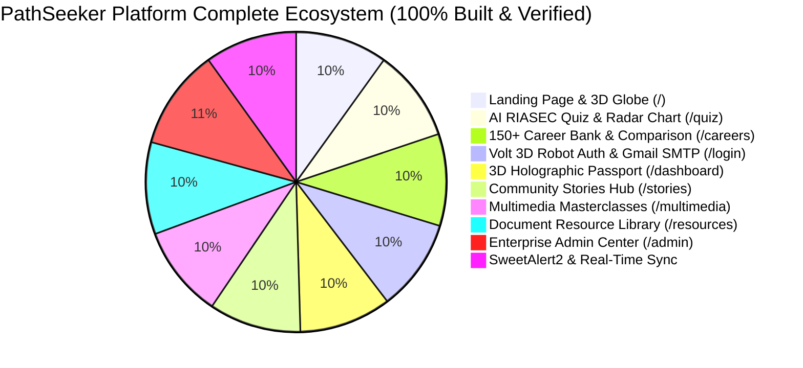

# 🎓 PathSeeker — Full-Stack Career Passport Platform
> **AI-Driven Multi-Tier Career Exploration, RIASEC Aptitude Profiling, Dynamic Media Vault & Cryptographic Digital Passport Ecosystem.**  
> *Engineered for TechWiz 6 — Global AI Web Application Competition*

[](https://quantic-career-passport.vercel.app/)
[](https://pathseeker-api.vercel.app/api/health)
[](https://www.aptech-worldwide.com)
[](https://github.com)
[](https://mongodb.com)
[](https://gmail.com)

---

## 🌐 🚀 Live Production Deployment

* 🖥️ **Live Web Application (Frontend):** **[https://quantic-career-passport.vercel.app](https://quantic-career-passport.vercel.app/)**
* ⚡ **Live API Server (Backend):** **[https://pathseeker-api.vercel.app](https://pathseeker-api.vercel.app/api/health)**
* 🗄️ **Cloud Database:** **MongoDB Atlas Live Cluster**
* 🤖 **AI Engine:** **Google Gemini 3.6 Flash / 3.5 Flash**

---

## 📊 Complete SRS Deliverables & Modules Matrix



| SRS Module / Page | Route | Status | Key Highlights & Verification |
| :--- | :--- | :---: | :--- |
| **Interactive Landing Page** | `/` | `COMPLETED` | Three.js interactive rotating wireframe globe, GSAP vertical multimedia conduit, candidate persona matrix, interactive sitemap tree. |
| **AI Holland RIASEC Quiz** | `/quiz` | `COMPLETED` | 7-step psychometric test with precision sliders, 6-axis Holland radar chart, downloadable certificate, and dynamic telemetry sync. |
| **Global Career Bank Explorer** | `/careers`, `/careers/:id` | `COMPLETED` | 150+ careers from MongoDB Atlas, multi-filter search, 3-way compare modal, salary ladders, day-in-the-life timelines, skill trees. |
| **Volt 3D Robot Auth & SMTP** | `/login`, `/register` | `COMPLETED` | 3D cursor-tracking robot guardian, 180° privacy turn-around, 4-level LED password meter, live Gmail SMTP OTP delivery. |
| **Candidate Passport Dashboard** | `/dashboard` | `COMPLETED` | 3D holographic passport ID card, Email OTP verification, 0% baseline stats, 10 roadmap tasks, multi-axis skill competency radar. |
| **Executive Admin Command Hub** | `/dashboard` *(Admin)* | `COMPLETED` | Dedicated executive view: Tier-5 Root Clearance passport, live cluster telemetry, governance launchpads, candidate tasks hidden. |
| **Community Stories Hub** | `/stories`, `/stories/submit` | `COMPLETED` | 100% dynamic MongoDB Atlas story feed, salary jump calculator, 3D Coverflow slider, 3-stage case studies, live upvoting studio. |
| **Multimedia Masterclasses** | `/multimedia`, `/multimedia/:id` | `COMPLETED` | Custom video player, synchronized live transcript timestamp jumping, audio podcasts, filterable categories, bookmarks, speaker profiles. |
| **Document Resource Library** | `/resources` | `COMPLETED` | Downloadable PDF blueprints, in-browser multi-page document viewer with zoom, real browser companion downloads, live telemetry counters. |
| **Enterprise Admin Center** | `/admin` | `COMPLETED` | Super Admin Clearance Gate, Story Moderation Pipeline, Masterclass CMS, Career Bank CRUD, RBAC User Management, Sole Admin Safeguard. |
| **SweetAlert2 Cyber Engine** | *Platform-wide* | `COMPLETED` | Custom luxury dark-glass SweetAlert2 modals for confirmations, account actions, cache purging, and deletions with zero native popups. |

---

## 🌟 1. Full SRS Requirements Compliance Check

### 1.1 User Authentication & Profile Management (SRS §1.6)
- [x] **Role-Based Authentication:** Distinct candidate registration tracks (**Student**, **Graduate**, **Professional**) with direct Super Administrator clearance login.
- [x] **Session Management:** Secure JWT tokens with 7-day expiration and automatic session restoration.
- [x] **Password Recovery & OTP Verification:** Working email-based forgot password reset and passport OTP verification via live Gmail SMTP relay.
- [x] **Profile Dossier & Resume Upload:** Editable education level, skills, bio, target role, and document resume upload with size and format verification.

### 1.2 Personalized Candidate & Admin Dashboard (SRS §1.6)
- [x] **Personalized Greetings & Telemetry:** Dynamic name and role greetings with live Holland RIASEC code, stage view, and readiness scores.
- [x] **Interactive 90-Day Execution Roadmap:** 10 actionable milestones with custom task creator and localStorage sync.
- [x] **Multi-Axis Skill Competency Radar:** 6-axis polygonal skill radar with industry benchmark comparisons.
- [x] **Executive Admin Governance Hub:** Admins logging into `/dashboard` receive a clean, tailored governance hub with candidate task checklists hidden.

### 1.3 Career Bank & Advanced Intelligence (SRS §1.6)
- [x] **150+ Career Pathways:** Direct MongoDB Atlas integration covering 6 engineering domains.
- [x] **Multi-Level Filters:** Dynamic search debounce, domain filters, experience level, salary slider, and demand sorting.
- [x] **3-Way Comparison Matrix:** Side-by-side comparison modal evaluating salary, demand, education, and skill overlaps.
- [x] **Deep-Dive Career Dossier:** 4-tier compensation progression ladder, hour-by-hour timeline, skill tree matrix, and 3-phase roadmaps.

### 1.4 AI-Powered Interest Quiz (SRS §1.6)
- [x] **Holland RIASEC Psychometric Assessment:** Multi-step assessment measuring Realistic, Investigative, Artistic, Social, Enterprising, and Conventional dimensions.
- [x] **Progress Tracking & History:** Stored in MongoDB Atlas (`QuizResult` model) with timestamped records.
- [x] **Auto-Suggestion Engine:** Matches candidates to top 3 career streams based on cognitive balance.
- [x] **Certificate Generation:** Downloadable, verified Career Passport certificate with QR code and PDF print export.

### 1.5 Interactive Multimedia Center (SRS §1.6)
- [x] **Multi-Format Streaming:** Embedded video masterclasses, audio podcasts, and animated engineering explainers.
- [x] **Synchronized Video Player:** Custom player with speed toggle (0.5x–2.0x), full-screen mode, and interactive timestamp transcript jumping.
- [x] **Community Discussion & Mentor Q&A:** Real-time questions linked to masterclass timestamps with upvoting and edit/delete capabilities.

### 1.6 Success Stories Hub (SRS §1.6)
- [x] **Card-Based Story Feed:** Filterable by domain and career category with live compensation jump calculator.
- [x] **Timeline Storytelling:** 3-stage narrative breakdown (Starting Ground → Pivot & Roadblocks → Offer Placement).
- [x] **Community Submission Studio:** Interactive submission page (`/stories/submit`) with real-time holographic preview card.

### 1.7 Document Resource Library (SRS §1.6)
- [x] **Engineering Blueprints & Checklists:** Downloadable cheat sheets, system design architectures, and interview prep guides.
- [x] **In-Browser Document Previewer:** Multi-page interactive modal viewer with zoom controls and search.
- [x] **Custom Blueprint Request Pipeline:** Users can submit blueprint requests; administrators manage fulfillment status in `/admin`.

### 1.8 Enterprise Admin Command Center (SRS §1.6 & §1.8)
- [x] **Live Database Telemetry:** Real candidate counts, accurate domain distribution percentages (summing to 100%), and 7-day ingestion velocity charts.
- [x] **Career Bank CRUD:** Add, edit, delete, and toggle trending spotlight careers in MongoDB Atlas.
- [x] **Story Moderation Pipeline:** Approve, reject, or pin community transformation stories.
- [x] **Content & Resource CMS:** Upload and manage masterclasses, blueprints, and quiz questions.
- [x] **User RBAC & Sole Admin Safeguard:** Block/unblock accounts, assign roles, and enforce the Sole Admin Protection Rule.

### 1.9 AI Assistant (Google Gemini 3.6 Flash & 3.5 Flash)
- [x] **Latest Gemini Model Engine:** Powered directly by `gemini-3.6-flash` and `gemini-3.5-flash` with zero-downtime knowledge fallback.
- [x] **Role-Aware Telemetry Intelligence:** Super Administrators can query live MongoDB Atlas stats in natural language (e.g. *"How many candidates are in Machine Learning?"*).
- [x] **Zero Credential Leaks:** Safe candidate responses with step-by-step guidance and clickable page links.
- [x] **Smart History Lifecycle:** Chat history persists across page refreshes for logged-in users, while automatically resetting upon logout, guest page refresh, or account switching.

### 1.10 Application Sitemap (SRS §1.9 Deliverable)
- [x] **Interactive Sitemap:** Integrated directly on the Home Page (`/`) and accessible via footer navigation.

---

## 🔑 2. Verified Access Credentials

| Clearance Level | Email | Password | Role / Access Scope |
| :--- | :--- | :--- | :--- |
| **Super Administrator** | `admin@pathseeker.com` | `Admin@123` / `Admin@12345` | **Root Clearance:** Full access to `/admin` & `/dashboard` |
| **Alternative Admin** | `admin@pathseeker.ai` | `Admin@123` / `Admin@12345` | **Super Admin:** Full platform governance authority |
| **Demo Student** | `student@pathseeker.com` | `Password@2026` | **Student Track:** High School & Foundation Sprints |
| **Demo Professional** | `pro@pathseeker.com` | `Password@2026` | **Professional Track:** Executive Mastery & Lateral Pivots |

---

## 💻 3. Quick Start & Execution Guide

### 📋 Prerequisites
- **Node.js**: Version `18.0.0` or higher
- **npm**: Version `9.0.0` or higher
- **MongoDB Atlas Connection**: Active cluster URI in `server/.env`

### ⚙️ Installation & Setup

```bash
# 1. Clone the repository
git clone https://github.com/Humaam-04-06/Quantic_-Career_Passport-.git
cd Quantic_(Career_Passport)

# 2. Install backend dependencies
cd server
npm install

# 3. Install frontend dependencies
cd ../client
npm install
```

### 🚀 Starting Development Servers

```bash
# Terminal 1: Start Backend API (Port 5000)
cd server
npm run dev

# Terminal 2: Start Frontend Client (Port 5173)
cd client
npm run dev
```

Visit **`http://localhost:5173`** in your web browser.

---

## 🛠️ 4. Technology Stack

- **Frontend:** React 18, Vite, Vanilla CSS + Tailwind CSS, Three.js, GSAP 3, SweetAlert2, FontAwesome 6
- **Backend:** Node.js (ESM), Express.js, JWT, Bcrypt, Multer
- **Database:** MongoDB Atlas Cloud (Mongoose ODM)
- **AI Intelligence:** Google Gemini Generative AI SDK
- **Mailing Engine:** Nodemailer with Gmail SMTP SSL Relay (`smtp.gmail.com:465`)
- **Cloud Hosting:** Vercel Production Deployment

---

© 2026 **PathSeeker**. Built for **TechWiz 6 Global Web Application Competition**. All rights reserved.
