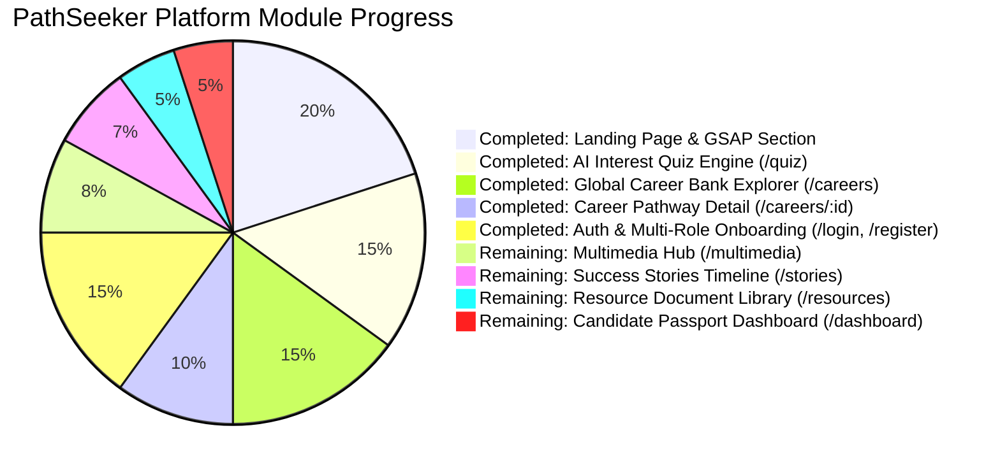

# 🎓 PathSeeker — Career Passport Platform
> **Empowering Students, Graduates, and Working Professionals to Discover What Fits Them Best.**  
> *Built for TechWiz 6 — Global AI-Driven Web Application Competition*

[](https://www.aptech-worldwide.com)
[](https://github.com)
[](https://github.com)
[](https://react.dev)

---

## 📊 Executive Project Status & Progress Tracker



| Module / Page | Route | Status | Key Highlights |
| :--- | :--- | :--- | :--- |
| **Interactive Landing Page** | `/` | `COMPLETED` | 3D rotating globe, fluid typography, vertical GSAP multimedia conduit, persona matrix, ultra-glass cards, sitemap. |
| **AI Interest Quiz & Stream Matching** | `/quiz` | `COMPLETED` | 7-step cognitive assessment, mathematical 6-axis RIASEC radar chart, Gemini AI service placeholder, exportable Career Passport certificate, 90-day roadmap. |
| **Global Career Bank Explorer** | `/careers` | `COMPLETED` | 6 sections: market intelligence ticker, domain filter pills, salary slider, live search, side-by-side comparison matrix modal (up to 3 roles), fitted background cards. |
| **Deep-Dive Career Pathway Detail** | `/careers/:id` | `COMPLETED` | 7 sections: role hero, 4-tier compensation ladder, hour-by-hour day in the life, skill tree matrix, 3-phase milestone roadmap, credentials, lateral pivots. |
| **Auth & Multi-Role Onboarding** | `/login`, `/register` | `COMPLETED` | 3D Volt robot guardian (cursor eye-tracking, privacy turnaround, password meter), candidate stage selector, 3D isometric tabs with synchronized image previews. |
| **Multimedia Masterclasses Hub** | `/multimedia`, `/multimedia/:id` | `UPCOMING` | Video player with synchronized live transcript accordions, audio podcasts, filterable categories, bookmarks, and speaker profiles. |
| **Success Stories & Community Hub** | `/stories`, `/stories/submit` | `UPCOMING` | Visual 3-stage timeline storytelling (Education → Challenge → Outcome), peer upvoting, filter by career transition, story submission modal. |
| **Document Resource Library** | `/resources` | `UPCOMING` | Downloadable career blueprints, salary guides, PDF live preview modal, category tabs, popularity sorting. |
| **Candidate Career Passport Dashboard** | `/dashboard` | `UPCOMING` | Candidate credential ID card, saved bookmarks, learning roadmap progress tracker, notes engine, export summary to PDF. |
| **Admin Control Panel & Analytics** | `/admin` | `UPCOMING` | Platform telemetry, user management, content moderation, career bank editor, sentiment insights. |

---

## 🚀 1. What Has Been Built (Completed Modules)

### 🌟 1.1 Signature Ultra-Glassmorphism & Design System
- **Color Palette:** Pure Pitch Black (`#000000`), Fiery Orange (`#E8602E`), Burnt Rust (`#BC4C22`), Gold Energy (`#FFB800`), Emerald (`#10B981`), Crisp White Headings (`#FFFFFF`), Soft Gray text (`#D4D4D8`).
- **Glassmorphism Spec:** Frosted dark smoke glass (`rgba(18, 18, 24, 0.75)`), specular top border highlight (`border-t-[rgba(255,255,255,0.25)]`), multi-stop gradient masks, ambient orange refraction glow fields, and inner bevel shadows.
- **Typography & Icons:** Google Fonts (*Outfit* / *Inter* / *Plus Jakarta Sans*) with FontAwesome SVG icons strictly (zero Unicode emojis).

---

### 🌐 1.2 Interactive Landing Page (`/`)
- **Notch Navigation Bar (`NotchNavbar.jsx`):** Sticky floating notch with active route pills, mobile drawer, and "Get Started" CTA.
- **3D Hero Section (`HeroSection.jsx`):** Interactive Three.js wireframe rotating globe with glowing pinpoint markers, paired with water-fluid animated text shaders.
- **Persona Selector (`PersonaSection.jsx`):** Role-tailored entry points for **Students**, **Fresh Graduates**, and **Working Professionals**.
- **Vertical GSAP Multimedia Section (`MultimediaSection.jsx`):** 2200px vertical track, 3D perspective isometric tablet background, glowing curving SVG trails (`#linePath01`–`#linePath04`) driven by `--strokeDashoffset`, and masterclass cards with Framer Motion transcript accordions.
- **Career Spotlight Section (`CareerSpotlightSection.jsx`):** Fitted content-related background images with high visibility (`opacity-60` to `80%`), hover zoom, and domain category tabs.
- **Interactive Home Sitemap (`SitemapSection.jsx`):** Visual categorized site directory.
- **Glass Footer (`Footer.jsx`):** Multi-column navigation, newsletter subscription input, and social links.

---

### 🧠 1.3 AI Interest Quiz & Stream Matching Engine (`/quiz`)
- **7-Step Cognitive Assessment (`QuizQuestionCard.jsx` & `quizQuestions.js`):**
  1. *Coding & Systems Automation* (1–10 Precision Slider)
  2. *Visual Design, UI/UX & Aesthetics* (5-point Likert Scale)
  3. *Quantitative Modeling & Math* (5-point Likert Scale)
  4. *Social Empathy & Leadership* (5-point Likert Scale)
  5. *Commercial Strategy & Business* (5-point Likert Scale)
  6. *Systematic Precision & QA* (5-point Likert Scale)
  7. *Preferred Work Velocity* (Interactive Scenario Choice Cards)
- **Gemini AI Service Connector (`geminiService.js`):**
  - Features designated API placeholder: `import.meta.env.VITE_GEMINI_API_KEY || "YOUR_GEMINI_API_KEY_HERE"`.
  - Built-in heuristic intelligence fallback engine generating rich personalized recommendations even without an API key.
- **Mathematical 6-Axis RIASEC Spider Chart (`RadarSkillChart.jsx`):** Real-time SVG polygon visualization plotting *Realistic, Investigative, Artistic, Social, Enterprising, Conventional* cognitive dimensions.
- **Digital Career Passport Certificate (`PassportCertificate.jsx`):** Ultra-glass credential badge with custom ID (`#CP-2026-XXXX`), verified seal, QR code, and **Print / Export PDF** + **Share Link** buttons.
- **Multi-Tab Comprehensive Results Dashboard (`QuizResults.jsx`):** Matched roles, radar aptitude breakdown, and 3-phase 90-day action roadmaps.

---

### 💼 1.4 Global Career Bank Explorer (`/careers`)
- **Section 1: Hero & Market Intelligence Ticker:** Live ticker chips (*150+ Roles, $148k Avg Comp, +28% YoY AI/Cloud Growth, 12 Clusters*).
- **Section 2: Multi-Filter Control Center (`CareerFilterBar.jsx`):** Real-time search debounce, domain category tabs, minimum target salary slider ($50k–$200k+), experience level dropdown, and reset filters button.
- **Section 3: Sticky Bottom Comparison Matrix Tray & Modal (`CareerCompareModal.jsx`):** Compare any 2–3 careers side-by-side on compensation, demand, lifestyle scores, and hard skill overlaps.
- **Section 4: Ultra-Glass Career Grid (`CareerCard.jsx`):** High-resolution content-specific background images fitted with frosted gradient masks, trending badges, bookmarking toggles, and direct roadmap links.
- **Section 5: Macroeconomic Compensation Benchmarks:** Industry domain salary comparison matrix.
- **Section 6: AI Interest Match Callout:** Direct conduit directing users to `/quiz`.

---

### 🗺️ 1.5 Deep-Dive Career Pathway Detail (`/careers/:id`)
- **Section 1: Role Hero & Passport Code Badge:** Title, category, Passport ID (`#CP-AI-01`), exponential demand badge, bookmark, and share actions.
- **Section 2: 4-Tier Compensation Progression Ladder (`SalaryProgressionLadder.jsx`):** Interactive ladder tracking expectations from *Junior Associate* ➔ *Mid-Level* ➔ *Senior Specialist* ➔ *Principal Architect*.
- **Section 3: Hour-by-Hour "Day in the Life" Timeline (`DayInLifeTimeline.jsx`):** Interactive daily operational schedule from morning standup to architecture coding and research reading.
- **Section 4: Core Skill Tree & Tool Stack Matrix (`SkillTreeMatrix.jsx`):** Categorized Technical Hard Skills, Soft Competencies, and Essential Industry Tools.
- **Section 5: 3-Phase Step-by-Step Verified Learning Roadmap (`RoadmapTimeline.jsx`):** Interactive milestone checklist with checkboxes and capstone requirements.
- **Section 6: Certified Credentials & Academic Prerequisites:** Recommended industry certifications and education pathways.
- **Section 7: Adjacent Career Lateral Pivots:** Lateral career branches allowing users to inspect related roles.

---

### 🤖 1.6 User Authentication & Multi-Role Onboarding (`/login` & `/register`)
- **Interactive 3D Robot Guardian ("Volt") (`VoltAuthCard.jsx`):**
  - Real-time 3D head and eye cursor tracking (`rotateX`, `rotateY`, `translateY`).
  - Follows typing character length.
  - Zero-knowledge privacy turn-around: Robot turns 180° around on password focus.
  - Back-head password strength meter with 4-level LED indicators.
  - Contextual speech bubble assistant for PathSeeker onboarding.
- **Multi-Role Candidate Onboarding:** Candidate stage selector (*Student Pathway, Fresh Graduate Pathway, Working Professional*).
- **Curved Sliding Panels:** Smooth animated transitions between Login and Registration modes.
- **Flanking 3D Isometric Navigation Cards (`TabNavigation.jsx` & `AuthPage.jsx`):**
  - **Left Card:** Heading + FontAwesome Icon + Paragraph (*Passport Quantum Vault, AI Telemetry Signals, Zero-Knowledge Privacy*).
  - **Right 3D Isometric Card:** High-resolution synchronized visual preview images matching the active left-side tab in real time.
- **Full Viewport Animated Background:** Fixed `100vw x 100vh` background transition between `/login_bg.png` and `/signup_bg.png`.

---

## ⏳ 2. What Is Remaining (To Be Built)

```
├── 1. Multimedia Masterclasses Hub (/multimedia & /multimedia/:id)
│   ├── Video Player with Synchronized Transcript Accordions
│   ├── Audio Podcast Player with Speed Controls & Waveforms
│   ├── Filter by Domain & Career Track
│   └── Speaker / Mentor Profiles & Interactive Comments
│
├── 2. Success Stories & Community Hub (/stories & /stories/submit)
│   ├── Visual 3-Stage Journey Timeline (Education → Challenge → Outcome)
│   ├── Filter by Career Transition (e.g. Non-tech to AI Engineer)
│   ├── Story Submission Modal with Image Upload
│   └── Community Upvoting & Bookmarking
│
├── 3. Document Resource Library (/resources)
│   ├── Downloadable Career Blueprints, Cheat Sheets & PDF Guides
│   ├── Interactive Live PDF Preview Modal
│   ├── Filter by Category & Popularity Sorting
│   └── Download Counter Telemetry
│
├── 4. Candidate Career Passport Dashboard (/dashboard)
│   ├── Candidate Digital Passport ID Card with QR Code
│   ├── Saved Bookmarks & Pinned Roadmaps
│   ├── Milestone Progress Tracking & Checklist Storage
│   └── Export My Passport Summary to PDF
│
└── 5. Admin Control Panel & Platform Telemetry (/admin)
    ├── Platform Analytics & User Traffic Overview
    ├── Career Bank CRUD Content Management
    ├── Success Stories Moderation Queue
    └── Real-Time Quiz Score Telemetry
```

---

## 🛠️ 3. Technology Stack & Setup

### Frontend Architecture
- **Framework:** React 18 (Vite Bundler)
- **Styling:** Vanilla Tailwind CSS + Custom Ultra-Glassmorphism Design System
- **Animation & 3D:** GSAP (ScrollTrigger), Three.js, Lucide/FontAwesome SVG icons, Framer Motion
- **AI Integration:** Google Gemini 1.5 Flash API connector with deterministic heuristic fallback

### Running the Application Locally
```bash
# 1. Navigate to client folder
cd client

# 2. Install dependencies
npm install

# 3. Start development server
npm run dev

# 4. Verify production build
npm run build
```

---

## 🧭 4. Next Step Recommendation

To continue building out the complete PathSeeker application systematically, here is the recommended sequence:

1. **Option 4 (Recommended Next): Multimedia Center & Interactive Podcast Hub (`/multimedia` & `/multimedia/:id`)**
   - *Rationale:* Builds on top of our existing vertical GSAP multimedia section, providing a dedicated masterclass streaming library with video players, interactive synchronized transcript accordions, audio podcasts, and mentor profiles.
2. **Option 5: Success Stories & Community Timeline Hub (`/stories`)**
3. **Option 6: Document Resource Library (`/resources`)**
4. **Option 7: Candidate Career Passport Dashboard (`/dashboard`)**
